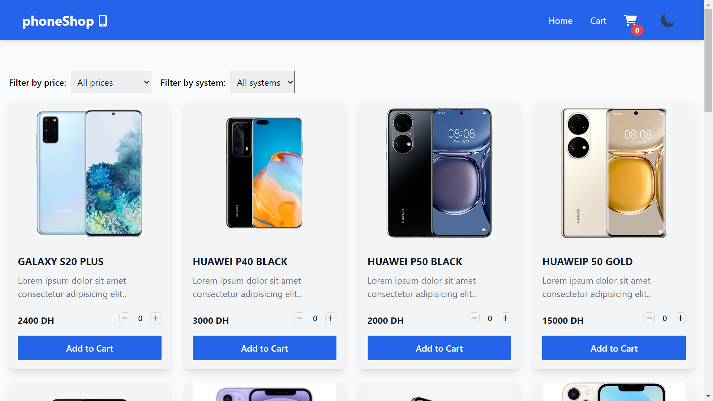

# PhoneShop

_Modern React Application for Buying Phones and Managing a Shopping Cart_

---

## Table of Contents

- [Overview](#overview)
- [Features](#features)
- [Technologies](#technologies)
- [Deployment](#deployment)
- [Author](#author)

---

## Overview

PhoneShop is a responsive e-commerce application built with **React Class Components**, featuring a dynamic shopping cart and toast notifications for an improved user experience. The application utilizes **state** and **component lifecycle methods** to manage and update the shopping cart. **Tailwind CSS** is used to ensure the application is visually appealing and fully responsive.

## 

## Features

- **Shopping Cart**: Add, remove, and update items in the cart seamlessly using state and lifecycle methods.
- **Toast Notifications**: User-friendly alerts using **React-Toastify**.
- **Responsive Design**: Optimized for both desktop and mobile devices with **Tailwind CSS**.
- **Dynamic Data Handling**: Update cart totals and item quantities in real time through state management.
- **Error Handling**: Graceful error management with notifications.

---

## Technologies

- **React** (Class Components with state and lifecycle methods)
- **React-Toastify** for notifications
- **Tailwind CSS** for responsive and modern styling
- **JavaScript** for functionality
- **Vite** for fast builds and development

---

## Deployment

# [PhoneShop Application](https://salaheddineaz47.github.io/phoneShop/)

---

## Author

- Salah Eddine Ait Zenni
- GitHub: [salaheddineaz47](https://github.com/salaheddineaz47)

---

**Feel free to reach out if you have any questions or suggestions!**
